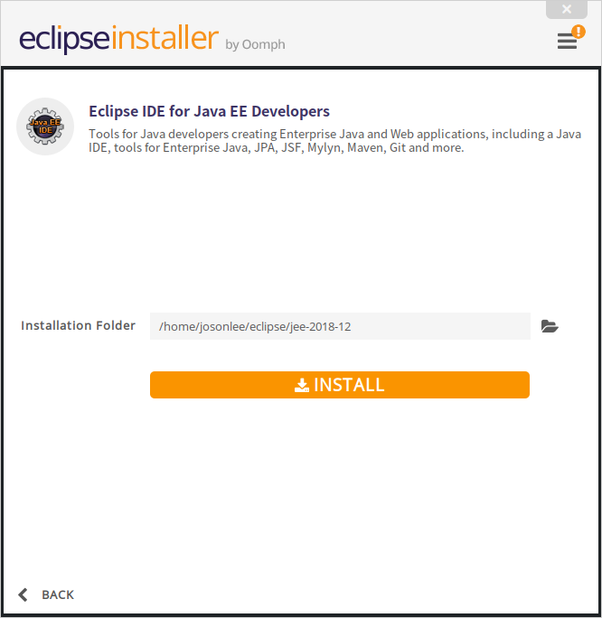
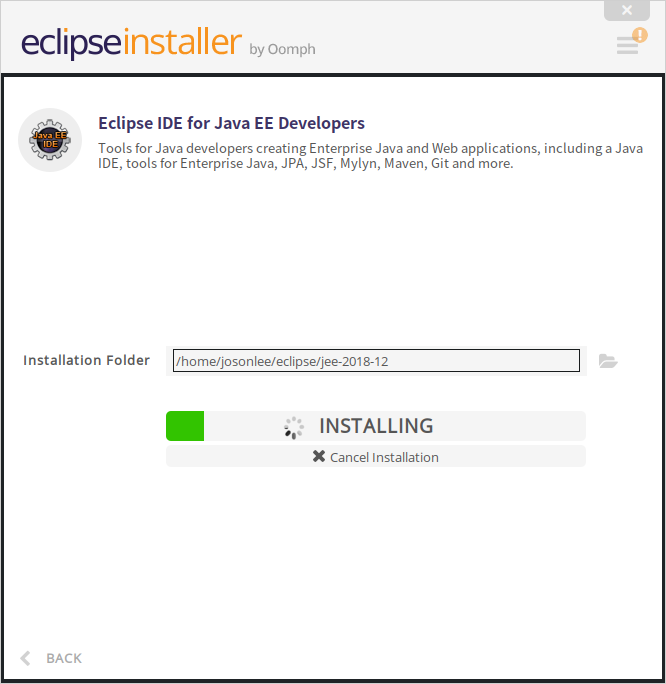
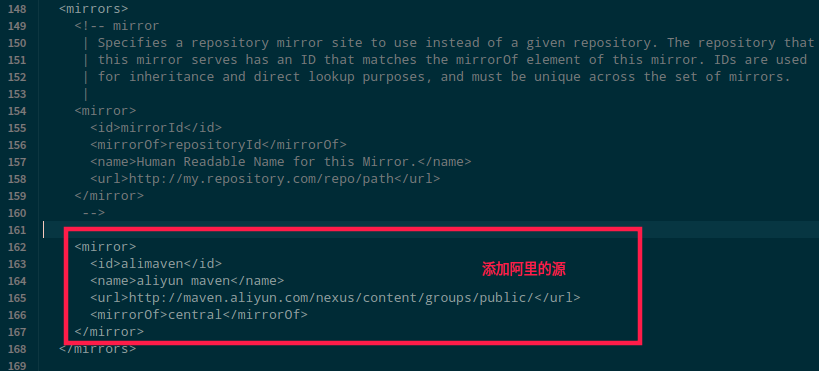
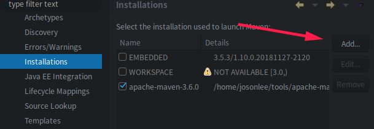
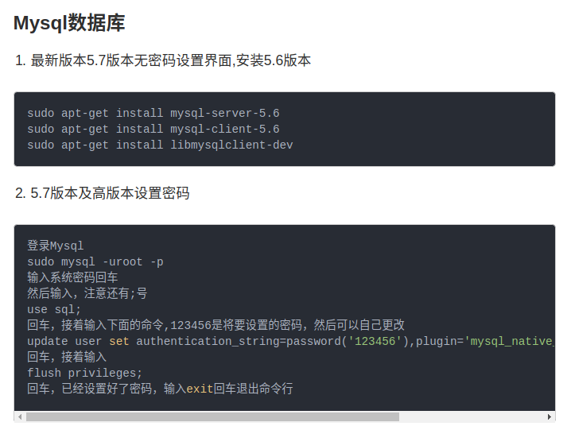
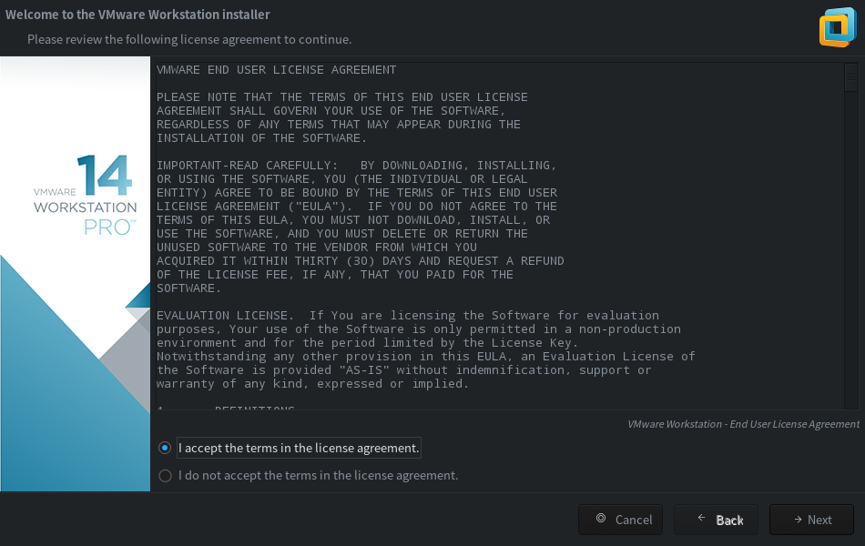
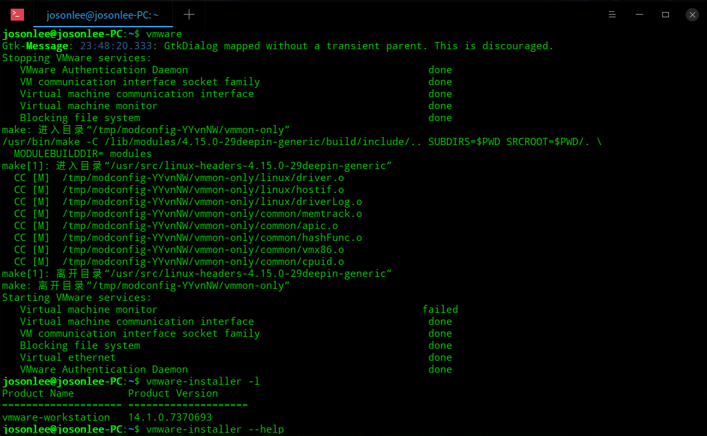

以下操作都在终端进行，`Ctrl+Alt+t`打开终端，或者随便哪鼠标右键即可打开
`sudo su`可以切换root用户权限

### 安装java环境

- [官网下载](https://www.oracle.com/technetwork/java/javase/downloads/jdk8-downloads-2133151.html)，我这里下的是`jdk-8u191-linux-x64.tar.gz`（我电脑64位的，你看情况选择其他版本也可以）
- 解压到 `/opt/` 目录下（其他位置也可以，opt下用来安装的），

```
tar -zxvf jdk-8u191-linux-x64.tar.gz -C /opt/
```

- 如图配置全局环境变量`sudo vi /etc/profile`，在末尾添加图中内容即可（红线内容替换成你下的版本）


- 使用source命令使之生效 `source /etc/profile`
- 然后输入 `java -version` 可以看到java版本信息就成功了

### eclipse安装


建议选择下面的源码包直接下载下来用，省的因为网络原因导致eclipse installer无法成功安装
- 选择eclipse installer安装过程
    - `tar -zxvf eclipse-inst-linux64.tar.gz -C ～`，我这里是解压到用户目录下
    - 解压后会生成一个eclipse-installer目录，用ll命令查看，可见其下有一个可执行文件eclipse-inst
    - 命令行下运行 `eclipse-installer/eclipse-inst`,就进入图形化安装了





然后，就是等待安装结束即可。我花了300多M手机流量，没按成功，网络延迟问题吧。然后，我又花了300多M手机流量直接下载源码包安装了，如下

- 直接下载package使用


解压后会在用户目录下生成一个eclipse文件夹，用ll命令查看下文件夹下内容


如下运行该可执行文件，然后选择下工作区间workspace就可以了
```
josonlee@josonlee-PC:~$ eclipse/eclipse 
```


#### 配置eclipse启动图标并添加到桌面
看过我上一篇文章Deepin下Python开发环境配置的应该知道如何处理。在`/usr/share/applications`下新建一个eclipse.desktop文件并编辑，添加如下内容：
```
[Desktop Entry]
Version=1.0
Type=Application
Name=Eclipse For J2EE
Icon=/home/josonlee/eclipse/icon.xpm
Exec="/home/josonlee/eclipse/eclipse" %f
Comment=Java IDE for J2EE Developers
Categories=Development;IDE;
Terminal=false
```
Icon:启动项图片，Exec：可执行文件（上面提到的执行他才能启动eclipse），Comment：概述，Categories：分类，Terminal：启动时是否显示终端

#### 配置maven
1. 下载，https://mirrors.tuna.tsinghua.edu.cn/apache/maven/
2. 解压，我这里是用户目录下的tools文件夹，`tar -zxvf apache-maven-3.6.0-bin.tar.gz -C ~/tools/`
3. 配置maven的环境变量，`vi /etc/profile`，追加如下内容
```
# Maven环境配置
export MAVEN_HOME=/home/josonlee/tools/apache-maven-3.6.0
export PATH=$PATH:$MAVEN_HOME/bin:

```
4. `source /etc/profile` 使配置生效，然后输入`mvn -version`检验是否成功，如图就是OK了


5. 在apache-maven-3.6.0/conf/setting.xml中配置阿里的镜像源

```
<mirror>
      <id>alimaven</id>
      <name>aliyun maven</name>
      <url>http://maven.aliyun.com/nexus/content/groups/public/</url>
      <mirrorOf>central</mirrorOf>        
    </mirror>
```
如图处


6. 再配置下jar包下载在本地的什么位置,apache-maven-3.6.0/conf/setting.xml中配置

默认是用户目录下的`.m2`目录下
```
<localRepository>/home/josonlee/tools/Maven_Repository/</localRepository>
```

7. 命令行下执行 `mvn help:system` ,下载一些必须的包

8. 配置eclips中maven插件

因为我们这里已经安装好maven了，所有直接在eclipse中导入就好了。窗口Window->preferences–>maven–>Installations。如图选择add，然后把你maven安装的目录导进来就好了。

下面这个也要配置一下


### MySQL数据库安装
- [deepin安装MySQL5.7](https://blog.csdn.net/sinat_37064286/article/details/82224562)
- [在deepin上安装mysql](https://blog.csdn.net/guanripeng/article/details/79626033)


https://www.jianshu.com/p/de6abe2245fb

### VMWare安装
首先是下载，Deepin应用商店里有这个可以直接下载。但它默认是安装在opt目录下，我根目录给的空间不够大，所以只好找它的源码包安装了。
最新的VMWare已经15版本了，版本新未必适合自己，所以就搜索了些旧版本。
- [点击这里下载最新版本](https://www.vmware.com/products/workstation-pro.html)
- [下载VMWare 14版本](http://www.anxia.com/l/vmware-workstation-12-pro)
- [下载VMWare 12](http://www.anxia.com/l/vmware-workstation-12-pro_87497)

我这里下的是14的，之前在win10上也是用的14,再分享下使用的激活码Key
```
# 14的
VF19H-8YY5L-48DQY-JEWNG-YPKF6
FF31K-AHZD1-H8ETZ-8WWEZ-WUUVA
# 15的
ZF582-0NW5N-H8D2P-0XZEE-Z22VA
```

下载下来会是类似`VMware-Workstation-Full-14.1.0-7370693.x86_64.bundle`的文件
- 移动的目标目录下（我依然是选用户目录），`mv VMware-Workstation-Full-14.1.0-7370693.x86_64.bundle ~/`
- 因为这是个安装文件，是可执行的，所有要付权限
    - `chmod 755 VMware-Workstation-Full-14.1.0-7370693.x86_64.bundle`
- 执行该文件，**执行该文件要付root权限**，否则无法安装
    - `cd ~`
    - `sudo ./VMware-Workstation-Full-14.1.0-7370693.x86_64.bundle`
- 进入界面化安装过程，剩余同Windows下一样的



安装完成后，命令行输入vmware启动虚拟机。我这里会有弹窗提示，如图


这是因为你安装的Linux内核比较新，比当前VMware编译时调用的版本高，某些内核code接口对应不上

然后，我就遇到了下图所示的问题


#### Virtual machine monitor failed导致无法启动VMWare解决

查了很久，找到解决办法，进入bios里把secure boot关掉就行了

> 参考：http://stackmirror.caup.cn/page/s1dw3oz5em9d 和
https://askubuntu.com/questions/767791/vmware-virtual-machine-monitor-failed-in-ubuntu-16-04-lts

此方法不一定有用，我试了两台机子，两台都遇到了这个问题，但有一台对该方法没有用（最后是在应用商店上装的，可以用）
#### 如何卸载VMWare

上面这个方法不一定有用，没用的话，你可以选择卸载它，然后考虑安装VirtualBox
```
# 卸载vmware
sudo vmware-installer -u vmware-workstation
```
还有就是，我从deepin的启动器里看到还有


### VMware最小化安装centos 搭建集群
我这里选择最小化安装，没啥难度，不会网上搜一波吧。

有一点需要注意，最小化安装Centos时，网络配置处要打开网络，否则重启不能上网。如果忘选了的话，如下配置网卡也可以
```
# 激活网卡
# 切换root用户

vi /etc/sysconfig/network-scripts/ifcfg-enp0s3

# 将 ONBOOT=no 改为 ONBOOT=yes
# 重启network服务

service network restart

```

然后还需要安装net-tools包，否则ifconfig不起作用
```
yum install net-tools
```

避免网络原因导致下载速度慢，还需配置下Centos的源

0、先下载wget工具 `yum -y install wget`

--------------------- 
1、备份

`mv /etc/yum.repos.d/CentOS-Base.repo /etc/yum.repos.d/CentOS-Base.repo.backup`

2、下载新的`CentOS-Base.repo` 到`/etc/yum.repos.d/`

```
CentOS 5

wget -O /etc/yum.repos.d/CentOS-Base.repo http://mirrors.aliyun.com/repo/Centos-5.repo


CentOS 6

wget -O /etc/yum.repos.d/CentOS-Base.repo http://mirrors.aliyun.com/repo/Centos-6.repo


CentOS 7

wget -O /etc/yum.repos.d/CentOS-Base.repo http://mirrors.aliyun.com/repo/Centos-7.repo

--------------------- 
参考：[CentOS源设置 作者：Pipci](https://blog.csdn.net/Pipcie/article/details/80005006)
```

3、清理yum缓存 
yum clean all
4、重建缓存 
yum makecache 
5、升级Linux系统
yum -y update 