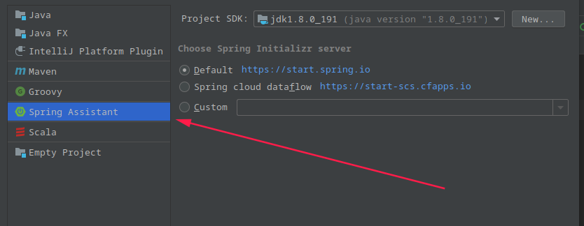
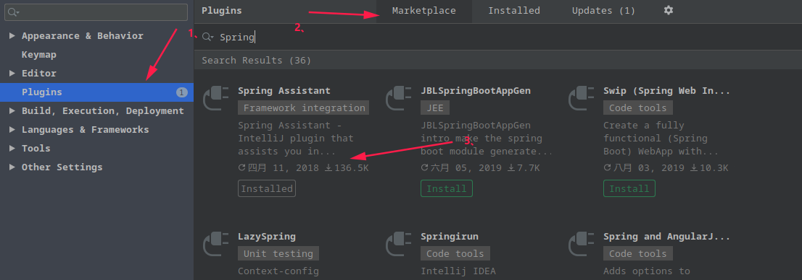

## 20191022
开始学习Spring Boot，参考了一些博文，列出以下注意项
> jdk 1.8
> spring boot 2.2
> IDEA Community版本

### Tip1：如何新建一个Spring boot项目
- 借助 https://start.spring.io/ 官网的*Spring Initializr*新建
  - 选中 *Spring Web* 依赖
  
  - 下载后导入Maven即可
  > 点击IDEA File --> New --> Project from Existing Sources... --> 选择你解压后的项目文件夹目录 --> 点击Ok --> 选择Import project from external model --> 选中Maven --> 一路点击Next直到项目导入成功

- 借助IDEA新建

和有些博客不同的是，依赖项选择*Spring Web*（版本更新，所以名字也变了）


其实可以直接创建Maven项目，只要配置好pom.xml就行了。从上面创建的项目下POM中可以看出添加了以下项：

```xml
<parent>
		<groupId>org.springframework.boot</groupId>
		<artifactId>spring-boot-starter-parent</artifactId>
		<version>2.2.0.RELEASE</version>
		<relativePath/> <!-- lookup parent from repository -->
	</parent>
```
引入了一个名为spring-boot-starter-parent的父项目，里面包含了常用的依赖和合适版本

```xml
<dependency>
			<groupId>org.springframework.boot</groupId>
			<artifactId>spring-boot-starter-web</artifactId>
		</dependency>

		<dependency>
			<groupId>org.springframework.boot</groupId>
			<artifactId>spring-boot-starter-test</artifactId>
			<scope>test</scope>
			<exclusions>
				<exclusion>
					<groupId>org.junit.vintage</groupId>
					<artifactId>junit-vintage-engine</artifactId>
				</exclusion>
			</exclusions>
		</dependency>
```
两个依赖，主要是*spring-boot-starter-web*这个web启动器(Strater)，具体是啥我还不太清楚（待我先过一遍再来补充），看着应该是包含Spring MVC、RESTful和tomcat。另一个应该是测试相关的依赖吧
> 看到有地方说，Spring Boot就是把一些应用场景提取出来写成一个个启动器，项目需要哪些场景/功能就引入哪些启动器，也就引入了对应依赖

### Tip2：社区版的IDEA缺少Springboot初始化的插件

如图，缺少箭头所指的这个选项，解决办法如下：
- 进入*Settings*项（**Ctrl+Alter+S**）
- 如下图安装*Spring Assistant*插件，重启即可，然后新建项目就能看到上图所示的选项了


### running。。。
先写一个Controller类，如图新建一个包controller，然后定义一个hello的类


```java
import org.springframework.web.bind.annotation.RequestMapping;
import org.springframework.web.bind.annotation.RestController;

@RestController
public class hello {
    @RequestMapping(value = "hello/")
    public String Hello() {
        return "Hello SpringBoot";
    }
}
```

运行上图的SpringDemoApplication类的main方法，然后在浏览器访问 localhost:8080/hello/ (默认是8080端口)


### Tip3：配置文件和如何添加并获取系统配置
下图中的application.properties文件就是全局配置文件，用来改变Spring Boot中的默认配置项，命名是application（固定）。除此之外，还有application.yml这种格式的配置文件


创建application.properties文件时，会根据不同环境创建application-dev.properties、application-test.properties、application-prod.properties三个配置文件分别用于开发、测试、线上正式运行环境的配置，而application.properties适合任何环境。如果你想测试并读取application-test.properties文件中的配置，只需要在全局配置文件中配置`spring.profiles.active=test`，同理开发环境就是设成dev
> 要是部署在服务器上运行打包的jar，可以通过参数设置`java -jar XXX.jar --spring.profiles.active=test`读取application-test.properties文件中的配置

- 添加配置的语法
  - [深入Spring Boot (三)：Properties属性配置文件使用详解](https://blog.csdn.net/qq_21806621/article/details/79598183)
  - [深入Spring Boot (四)：YAML属性配置文件使用详解](https://blog.csdn.net/qq_21806621/article/details/79598233)
- 获取配置内容

比如说要配置运行环境的ip地址和端口号，我这里没有额外的ip，所以只改变端口号。在application.properties中设置
```xml
server.ip=127.0.0.1
server.port=8081
...
```
一样在Controller控制类中写一个获取当前运行环境的IP地址和端口号的方法，运行后在浏览器可查看（注意端口是8081）
```java
import org.springframework.beans.factory.annotation.Value;
import org.springframework.web.bind.annotation.RequestMapping;
import org.springframework.web.bind.annotation.RestController;

@RestController
public class hello {
    @Value("${server.ip}")
    public String serverIp;
    @Value("${server.port}")
    public String serverPort;
    
    @RequestMapping(value = "/getip")
    public String getServerIp() {
        return serverIp+":"+serverPort;
    }
}
```


从上面代码可知，可以通过`@Value("${xxx}")`这个注解获取配置文件中的值

> 还有一种把配置赋值给一个javabean的写法，现在还不懂javabean是啥，以后再看吧～～～