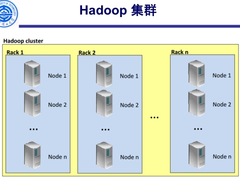
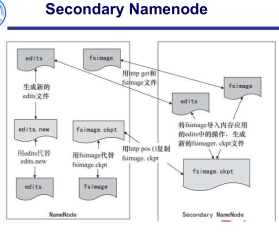
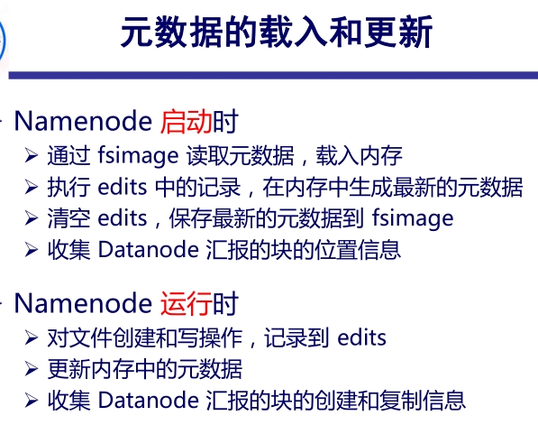

## 分布式文件系统 HDFS
分布式文件系统（Distributed FileSystem）是指文件系统管理的物理存储资源不一定直接连接在本地节点上，而是通过计算机网络与节点相连。

Hadoop有若干文件系统，HDFS只是其中一个，但HDFS是其重要组成部分。HDFS由java的`org.apache.hadoop.fs.FileSystem`定义，并实现了`java.io.Closeable`接口，继承了`org.apache.hadoop.conf`

我们可以通过命令行下 `hadoop dfs -ls hdfs:///` 访问HDFS文件系统

### HDFS特点
- 存储超大文件
- 流式文件访问
    - 高效访问模式：一次写入、多次访问
    - 只支持文件追加操作，不能修改
    - 追加操作要在hdfs-site.xml中的 dfs.support.append 设置为true才行
- 普通商用硬件上即可运行（实际上普通PC还是不OK，那速度，这都是氪金玩家玩的，hh）
- 低时间延迟的数据访问
    - 以高时延为代价，获取高数据吞吐量
    - 响应时间秒级、毫秒级的数据访问，应该采用HBase
- 多用户在写入文件时有锁机制，只支持单个写入者
- 不适合存大量小文件
>  由于 Namenode 将文件系统的元数据存储在内存中，因此
HDFS所能存储的文件总数受限于Namenode的内存容量
根据经验，每个文件、目录和数据块的存储信息大约占150
字节，存储100万个文件大约需要300M内存
<!--more-->
### 名称解释
1. Cluster 集群
2. Rack 机架
3. Client 客户机
4. Namenode 名称节点
5. Datanode 数据节点
6. Secondary NameNode 辅助(第二)名称节点
7. Metadata 元数据
8. Block 块

- 整体结构



- Namenode和Secondary Namenode

Namenode是HDFS的智脑，维护整个系统的目录树及目录树中的文件和目录
这些信息以镜像文件(FSImage)和编辑日志文件(edit log)的形式永久保存在本地磁盘上，在系统启动时被加载到内存

> 镜像文件(文件系统镜像)，HDFS元数据的完整快照，每次Namenode启动时会加载最新的镜像

Secondary Namenode不能按照名字以为是Namenode的备份，他只是负责将镜像文件和编辑日志合并，以此来控制 edits 文件的大小在合理的范围，缩短集
群重启时Namenode重建fsimage的时间。一般每个集群都有单独运行在一台服务器上的一个Secondary Namenode。Secondary Namenode也有恢复部分数据的作用


- Datanode 

数据节点，HDFS是master/slave结构，Namenode是主，Datanode是从。它存放的是实际的数据块，块在文件系统中会产生两个文件（实际的数据文件和块的附加信息文件，包含数据的校验和、生成时间）

Datanode通过心跳和namenode通信

- block

块，文件系统进行数据读写的最小单位，hadoop 2.7之前的块(block)默认64M，之后是128M，可以在 `hdfs-site.xml` 文件中 `dfs.block.size` 项中配置块大小，`dfs.replication` 配置备份份数

HDFS上文件会被分成若干块分开存储，使得文件可以比磁盘容量大，提供容错能力，也简化了存储子系统

不同于普通文件系统（即使文件大小小于块大小，仍占一个块的大小），HDFS小于一个块大小的文件不会占用整个块的空间

- MetaData

元数据包括**文件系统目录树信息**和**文件和块对应关系的信息**
    - 文件系统目录树信息
        - 文件名，目录名
        - 文件和目录的从属关系
        - 文件和目录的大小，创建及最后访问时间
        - 权限
    - 文件和块的对应关系
        - 文件由哪些块组成、块ID
        - 每个块的存放位置
其存储是依赖本地文件：镜像文件和编辑日志文件，前者保存上面提到的两类，后者保存的是客户端请求新建、移动、写文件操作时的记录（先记录在编辑日志，成功后才更改内存中数据）


### HDFS容错能力
- 可靠性（不出错）、可用性（出错还能提供服务）
- 文件系统的容错性 [引用：HDFS的容错能力](http://f.dataguru.cn/hadoop-25108-1-1.html)
```
1)心跳机制,在Namenode和Datanode之间维持心跳检测，当由于网络故障之类的原因，导致Datanode发出的心跳包没有被Namenode正常收到的时候，Namenode就不会将任何新的IO操作派发给那个Datanode，该Datanode上的数据被认为是无效的，因此Namenode会检测是否有文件block的副本数目小于设置值，如果小于就自动开始复制新的副本并分发到其他Datanode节点。

2）检测文件block的完整性，HDFS会记录每个新创建的文件的所有block的校验和。当以后检索这些文件的时候，从某个节点获取block，会首先确认校验和是否一致，如果不一致，会从其他Datanode节点上获取该block的副本。

3）集群的负载均衡，由于节点的失效或者增加，可能导致数据分布的不均匀，当某个Datanode节点的空闲空间大于一个临界值的时候，HDFS会自动从其他Datanode迁移数据过来。

4）Namenode上的fsimage和edits日志文件是HDFS的核心数据结构，如果这些文件损坏了，HDFS将失效。因而，Namenode可以配置成支持维护多个FsImage和Editlog的拷贝。任何对FsImage或者Editlog的修改，都将同步到它们的副本上。它总是选取最近的一致的FsImage和Editlog使用。Namenode在HDFS是单点存在，如果Namenode所在的机器错误，手工的干预是必须的。

5)文件的删除，删除并不是马上从Namenode移出namespace，而是放在/trash目录随时可恢复，直到超过设置时间才被正式移除。
```
- hadoop本身的容错性
    - 支持升级、回滚，升级出现不兼容等可以回滚
- 可参考：[Hadoop（七）HDFS容错机制详解](https://www.cnblogs.com/zhangyinhua/p/7681146.html)
### HDFS 副本存储机制
hdfs提供的是**三副本放置策略**，每个块在HDFS集群中会存储多份，默认3份。其目的是平衡二者：提高数据存储的可靠性、可用性（多备份一些），减少数据写入的开销（少备份一些）

三副本放置策略：

- 写请求方所在机器是其中一个Datanode（即客户端的节点），则第一份副本直接存放在本地，否则随机在集群中选择一个Datanode
- 第二个副本存放于不同于第一个副本所在机架的机架上某一个节点
- 第三个副本存放于第二个副本所在的机架,但是属于不同的节点

超过三份副本可随机放置，但满足：一个节点最多放一个副本，副本数少于机架数的两倍，则一个机架不能放超过两份副本

## HDFS读写文件流程
图片引自：[Hadoop--HDFS之读写流程](https://blog.xiaoxiaomo.com/2016/06/26/Hadoop-HDFS之读写流程/)
### 写入文件


### 读取文件


## 操作HDFS
### 命令行 [文档：命令手册](https://hadoop.apache.org/docs/r1.0.4/cn/commands_manual.html)
HDFS的基本命令
```
    -mkdir            在HDFS创建目录    hdfs dfs -mkdir /data
    -ls               查看根目录      hdfs dfs -ls /
    -ls -R            查看目录与子目录
    -put              上传一个文件      hdfs dfs -put data.txt /data/input
    -moveFromLocal    上传一个文件，会删除本地文件：ctrl + X
    -copyFromLocal    上传一个文件，与put一样
    -copyToLocal      下载文件  hdfs dfs -copyToLocal /data/input/data.txt 
    -get              下载文件  hdfs dfs -get /data/input/data.txt 
    -rm               删除文件  hdfs dfs -rm /data/input/data.txt 
    -getmerge         将目录所有的文件先合并，再下载
    -cp               拷贝： hdfs dfs -cp /data/input/data.txt  /data/input/data01.txt 
    -mv               移动： hdfs dfs -mv /data/input/data.txt  /data/input/data02.txt 
    -count            统计目录下的文件个数
    -text、-cat       查看文件的内容  hdfs dfs -cat /data/input/data.txt 
    -balancer         平衡操作
```

- 启动、关闭hdfs服务：start-dfs.sh/stop-dfs.sh
- jps 查看服务进程

HDFS的管理命令
```
hdfs version        查看版本
hdfs namenode [ -format ]       格式化
hdfs fsck <path> [ -files [ -blocks [ -locations | -racks ] ] ]     查看HDFS文件对应的文件块信息(Block)和位置信息
hdfs dfsadmin -report           文件系统使用报告
hdfs dfsadmin -safemode [ get | enter | leave ]         进入、退出安全模式
hdfs -help      帮助
```
### java API
- Configuration：HDFS环境配置类
- FileSystem：分布式文件系统类
- Path：HDFS文件路径类
- FSDataInputStream / FSDataOutputStream：文件系统输入输出流类
- URI：文件资源定位类

> 顺便提一下HDFS的URI格式是：hdfs://namenode主机名[或namenode的IP]:端口/文件路径

参考资料：

- [Hadoop（七）HDFS容错机制详解](https://www.cnblogs.com/zhangyinhua/p/7681146.html)
- [Hadoop--HDFS之读写流程](https://blog.xiaoxiaomo.com/2016/06/26/Hadoop-HDFS之读写流程/)
- [hadoop.apache.org 中文文档](https://hadoop.apache.org/docs/r1.0.4/cn/quickstart.html)